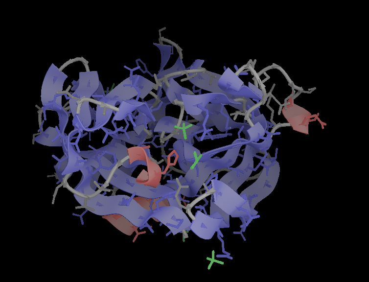

# pyball

A pure Python OpenGL ES protein viewer

# Dependencies

Written against Python 2.7. The dependencies are:

 - numpy
 - pdbremix
 - pyopengl
 - vispy
 
To install, do:

    pip install numpy pyopengl vispy

Then download:

    https://github.com/boscoh/pdbremix/archive/master.zip

And in the `pdbremix` directory:

    python setup.py install

# Usage

    python pyball.py 1cph.pdb

# Sidechains

Press `s` to turn sidechains on/off  
Press `q` to exit
