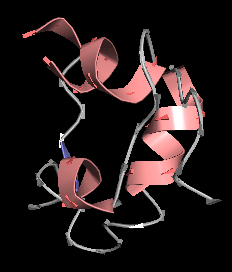

# pyball

A pure Python OpenGL ES protein viewer

# Dependencies

Written against Python 2.7. The dependencies are:

 - numpy
 - pdbremix
 - pyopengl

To install, do:

    pip install numpy pdbremix pyopengl

# Usage

    python pyball.py 1cph.pdb

# Sidechains

Press 's' to turn sidechains on/off
Press 'q' to exit
